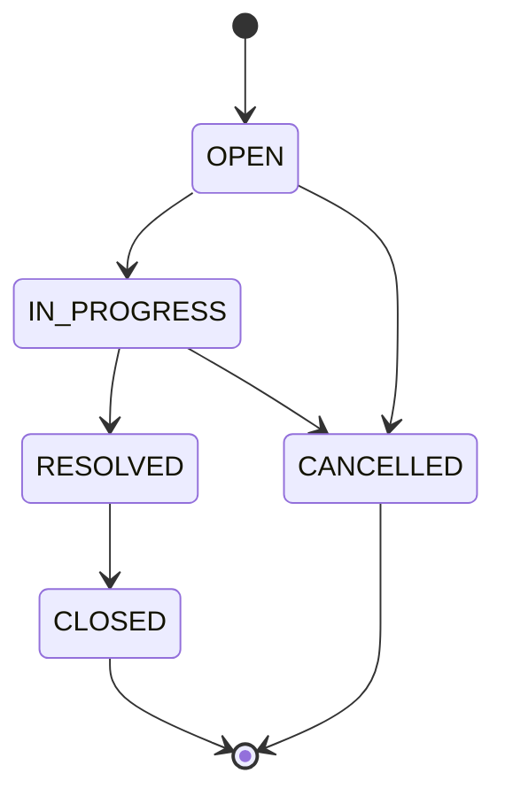

# Ticket Status State Machine

Source of truth for `TicketStatus`. The **service / domain** layer must enforce these rules. Controllers must not apply a transition the domain rejects. Tests must cover legal and illegal pairs with parameterized tests (`.cursor/rules/testing.mdc`).

Related: FR-4b in `spec/requirements.md`; `PATCH /api/v1/tickets/{id}/status` in `spec/api-contract.md`.

## Statuses

```text
OPEN | IN_PROGRESS | RESOLVED | CLOSED | CANCELLED
```

| Status | Meaning | Terminal? | Field PATCH / comments? |
| --- | --- | --- | --- |
| `OPEN` | Newly created, not being worked | no | yes |
| `IN_PROGRESS` | Work in progress | no | yes |
| `RESOLVED` | Work finished; awaiting close | no | yes |
| `CLOSED` | Done and locked | **yes** | **no** |
| `CANCELLED` | Abandoned without resolution | **yes** | **no** |

Initial status after create is always **`OPEN`**. There is no `NEW` or `REOPENED` status in v1.



---

## Legal transitions

Happy path (linear):

```text
OPEN → IN_PROGRESS → RESOLVED → CLOSED
```

Cancellation (from active work only):

```text
OPEN → CANCELLED
IN_PROGRESS → CANCELLED
```

`RESOLVED` **cannot** be cancelled; it can only move to `CLOSED`.

### Allowed matrix (from → to)

| From \ To   | OPEN | IN_PROGRESS | RESOLVED | CLOSED | CANCELLED |
| ----------- | ---- | ----------- | -------- | ------ | --------- |
| OPEN        | deny | **allow**   | deny     | deny   | **allow** |
| IN_PROGRESS | deny | deny        | **allow**| deny   | **allow** |
| RESOLVED    | deny | deny        | deny     | **allow** | deny   |
| CLOSED      | deny | deny        | deny     | deny   | deny      |
| CANCELLED   | deny | deny        | deny     | deny   | deny      |

Self-transitions (same status) are **invalid**. A no-op status change returns **422**.

### Complete allowed list (normative)

1. `OPEN` → `IN_PROGRESS`
2. `IN_PROGRESS` → `RESOLVED`
3. `RESOLVED` → `CLOSED`
4. `OPEN` → `CANCELLED`
5. `IN_PROGRESS` → `CANCELLED`

Any pair not in this list is illegal.

---

## Invalid transitions (normative deny list)

Forbidden transitions **must** be rejected with HTTP **422** and problem type `illegal-ticket-state`. The ticket row is **not** updated.

### Reopen / reverse (explicit)

- `CLOSED` → `OPEN`
- `CLOSED` → `IN_PROGRESS`
- `CLOSED` → `RESOLVED`
- `CLOSED` → `CANCELLED`
- `RESOLVED` → `OPEN`
- `RESOLVED` → `IN_PROGRESS`
- `RESOLVED` → `CANCELLED`
- `CANCELLED` → `OPEN`
- `CANCELLED` → `IN_PROGRESS`
- `CANCELLED` → `RESOLVED`
- `CANCELLED` → `CLOSED`

### Skip-ahead / skip-back on the happy path

- `OPEN` → `RESOLVED` (must pass through `IN_PROGRESS`)
- `OPEN` → `CLOSED`
- `IN_PROGRESS` → `OPEN`
- `IN_PROGRESS` → `CLOSED` (must pass through `RESOLVED`)

### Self-transitions

- `OPEN` → `OPEN`
- `IN_PROGRESS` → `IN_PROGRESS`
- `RESOLVED` → `RESOLVED`
- `CLOSED` → `CLOSED`
- `CANCELLED` → `CANCELLED`

Unknown `status` values are **not** state-machine violations; they are HTTP **400** (`invalid-status`).

---

## Guards and side effects

| Transition | Guards | Side effects |
| --- | --- | --- |
| `OPEN` → `IN_PROGRESS` | none in v1 (assignee may be null) | `updatedAt` |
| `IN_PROGRESS` → `RESOLVED` | none in v1 | `resolvedAt` if null; `updatedAt` |
| `RESOLVED` → `CLOSED` | none in v1 | `closedAt` if null; `updatedAt` |
| `OPEN` → `CANCELLED` | none | `closedAt` if null; `updatedAt` |
| `IN_PROGRESS` → `CANCELLED` | none | `closedAt` if null; `updatedAt` |

v1 does **not** require an assignee to enter `IN_PROGRESS`.

Terminal statuses (`CLOSED`, `CANCELLED`):

- `PATCH` of title/description/priority/assignee → **422** `ticket-not-mutable`
- `POST` comment → **422** `ticket-not-mutable`
- Status change → **422** `illegal-ticket-state`

---

## Implementation notes

- Encode the matrix as one domain function (e.g. `TicketStatus.canTransitionTo(TicketStatus target)`). Do not scatter transition `if` in controllers.
- Persist the enum **name** (`STRING`), not ordinal (`spec/data-model.md`).
- Parameterized tests must include **all five allowed** rows and deny coverage including at least `CLOSED→OPEN`, `RESOLVED→OPEN`, and `CANCELLED→OPEN`.
---
